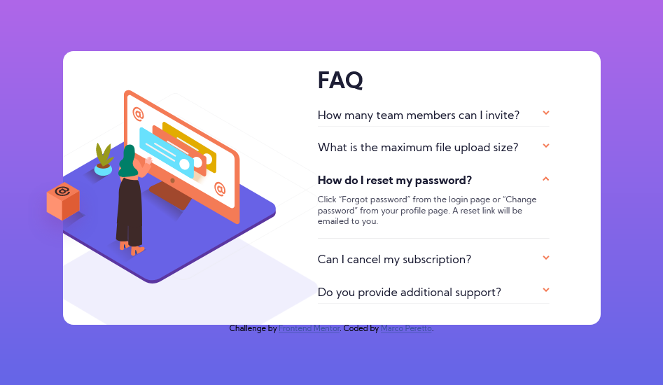
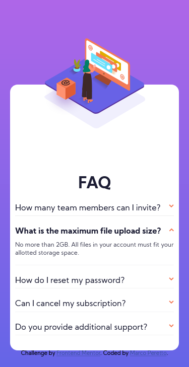

# Frontend Mentor - Testimonials grid section solution

This is a solution to the [FAQ accordion card challenge on Frontend Mentor](https://www.frontendmentor.io/challenges/faq-accordion-card-XlyjD0Oam). Frontend Mentor challenges help you improve your coding skills by building realistic projects. 

## Table of contents

- [Overview](#overview)
  - [The challenge](#the-challenge)
  - [Screenshot](#screenshot)
  - [Links](#links)
- [My process](#my-process)
  - [Built with](#built-with)
  - [What I learned](#what-i-learned)
  - [Useful resources](#useful-resources)
- [Author](#author)

## Overview

### The challenge

Users should be able to:

- View the optimal layout for the site depending on their device's screen size

### Screenshot

#### Desktop version:


#### Mobile version:


### Links

- Solution URL: [Solution](https://www.frontendmentor.io/solutions/only-css-faq-accordion-using-sass-and-flex-wlTutY8el)
- Live Site URL: [Live site](https://marcoperetto-faq-accordion-card-challenge.netlify.app/)

## My process

### Built with

- Semantic HTML5 markup
- CSS custom properties
- Flexbox
- Mobile-first workflow

### What I learned

Posizioning background
```scss
.faq__image {
        background-image: url('../images/bg-pattern-mobile.svg');
        background-size: 200px;
        background-position: 50% 0;
    }
```

Avoid use of JavaScript.
Make accordion with only CSS and HTML.

Use of label and input radio 
```html
<input type="radio" name="accordion" id="faq-1">
<label for="faq-1">
<div class="faq__accordion">
    <div class="faq__item">
    <div class="faq__item__title">
        <h3>How many team members can I invite?</h3>
        <div class="faq__icon">
        
        </div>
    </div>
    <div class="faq__content">
        <p class="faq__text">
        You can invite up to 2 additional users on the Free plan. There is no limit on 
        team members for the Premium plan.
        </p>
    </div>
    </div>
</div>
</label>
```

Use of :checked to show accordion
```scss
input[type="radio"] {
        visibility: hidden;
        &:checked + label {
            .faq__content {
                max-height: 100vh;
            }
            .faq__icon img {
                transform: rotateZ(180deg);
            }
            .faq__item__title h3 {
                font-weight: 700;
            }
        }
    }
```


### Useful resources

- [CSS Flex Guide](https://css-tricks.com/snippets/css/a-guide-to-flexbox/)

## Author

- Frontend Mentor - [@mperetto](https://www.frontendmentor.io/profile/mperetto)
- Linkedin - [Marco Peretto](https://www.linkedin.com/in/marco-peretto/)
